# - CooKd -

### T2A2 Marketplace Application - Daniel Kim

## R7 | Identify the Problem. 

Covid-19 has produced new and unique problems that have affected the global economy in an unprecedented scale. One in particular - out of the many indusrtires that've been affected, is the hospitalty industry. Resturants all over have closed or are restricted. What once was a fun endeavour, has and is slowly losing its appeal. 

Hospitality workers, especailly chefs have lost jobs. 

Consumers have also lost an importnant factor that plays in their work/life balance - entertainment by food. limited  choices have degraded consumer confidence as they now choose to just confide in thier own abode. 

## R8 | The Solution.

Cookd is a marketplace style web app that aims to bridge this forced gap in the market by connecting proffesional/ highly experienced chefs with home owners/ renters. 

Users looking to host a party, can order a professional chef to come into their home and take care of the whole restaurant experience, but in the comfort of their own home . 

The vision for this app was inspired by conveinace. 

Chefs have jobs again - or moreso their own buisness (sidehusltle if you will?)

Eager consumers now have a means to satisfy their entertainment "itch".

## R9 | Heroku Deployment

https://cookd-app.herokuapp.com/

## R10 | GitHub

https://github.com/d1koder/cookd_app

## R11 | What is Cookd?

#### 		1 | Purpose

Cookd is a two sided market place for the booking and creating lisitings for chefs and their services. The main focus will be for customers to browse various chefs online and to connect chefs with customers - and vice versa - so that chefs can have a platform to monetise their skills, and customers can conveinlty book a chef for their party.

#### 		2 | Functionality/ Features

Cookd will be let Chefs create profiles of themsleves, with their profile displayed on the home page in a blog style grid format, and each tile that highlights their skills, cuisines on offer and pricing and availability. This in turn will allow the user/s - or customer - to browse through a list of chefs and/or cuisines according to the user/s desire. The user/s will be able to click on each tile to reveal more information such as, the chefs ratings and their availability. The user can in turn make a sound decision to book their desired chef for a specific date/time. Chefs and users will have the ability to "CRUD" their profiles if they wish.

#### 2.1 User accounts

​	#talk about user account functionality, users can create accounts accroding to their purpose ie, chef or customer etc

#### 2.2 Browse

​	#talk about how the index page displays all the available chefs that have accounts, and how customers can browse

​	through a list or tiles of profiles.

#### 2.3 Chefs

 list of chefs available. users can scrollthrough thubmbnails of chefs and click to expand for more info

#### 2.4 My account

​	this is were users can login with their credentials, as either a chef or user

#### 2.5 About

​	this is where info about how to use the app and its purpose is detailed here

#### 2.6 FAQ

​	this is where users can acces privacy info and rules etc.

#### 		3 | Sitemap

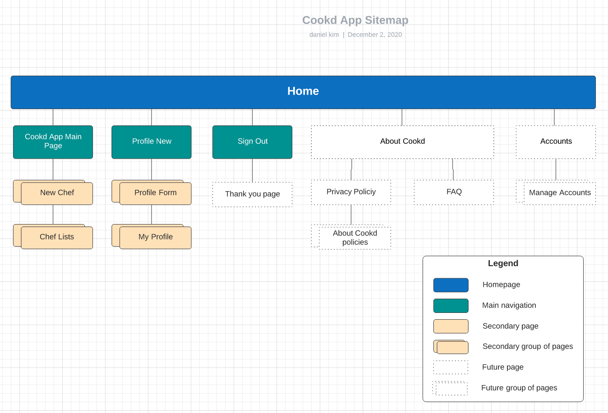

#### 		4 | Screenshots

* The Home Page - Cookd App.

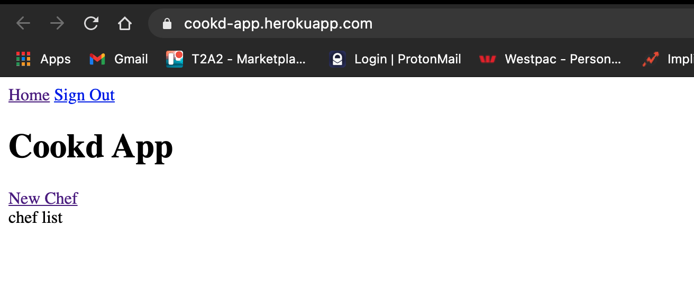

* Create a new Chef profile page - New Profile.

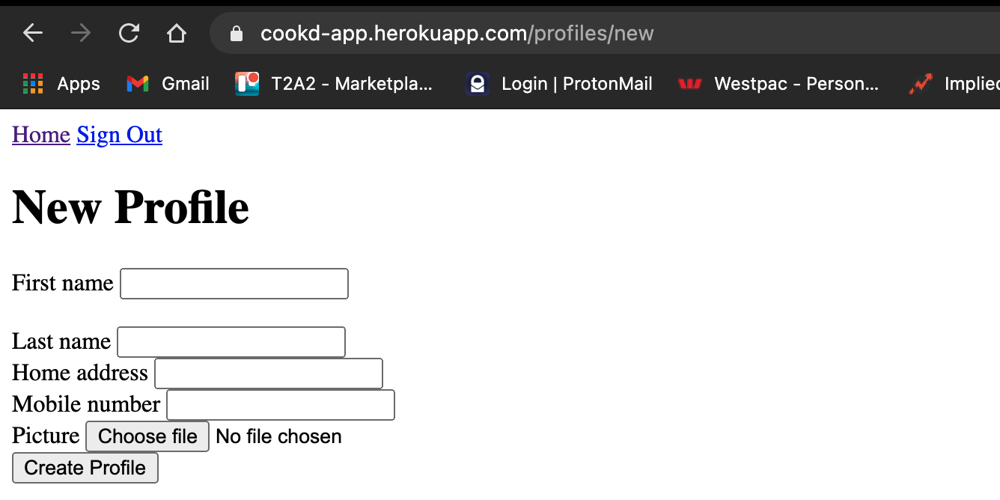

* A completed Chefs profile - My Profile.

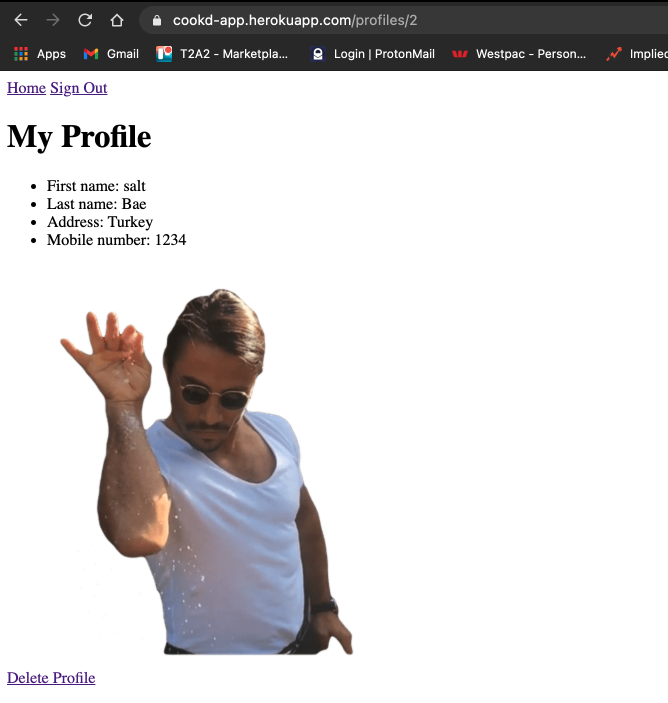


#### 		5 | Target Audience

Chefs looking to monetise their experience through a digital platform, and create themseleves a reputation in the process. 

Users looking for connivence when it comes to organising and hosting a party or event in their place of residence, without compromising on the quaility. 

#### 		6 | Tech Stack

| Technologies        |                 |
| ------------------- | --------------- |
| **Front-end**:      | HTML, CSS, Sass |
| **Back-end**:       | Ruby on Rails   |
| **Deployment**:     | Heroku          |
| **Active Storage**: | AWS, S3         |

## R12 | User Story 

As a cusotmer, I want to have an account, so that chefs that I book can be confirmed by me when they show up to my venue.

As a chef, I want an account, so that I may be able to monetise my services. 

As a chef, I want to be able to display my qualities such as experience and qualifications, so that customers have confidence in my abilities. 

As a chef I want a way to display my price and cuisines, so that customers can get an idea of prices.

As a chef I want a way to display my avialability, so that customers can plan to book in advanced. 

As a customer I want a way to display my address, so that the chef knows how far they have to travel to me/venue.

As a customer, I want to see what other customer reviews have been left, so that I can feel safe and be able to trust in the chefs abilities for my specific needs. 

As a chef, I want to be able to edit or delete listings, as I progress professionally.

As a customer, I want to be able to pay with a credit card, so that I can confirm my booking with a particular chef.


## R13 | Wireframes 

### Home Page

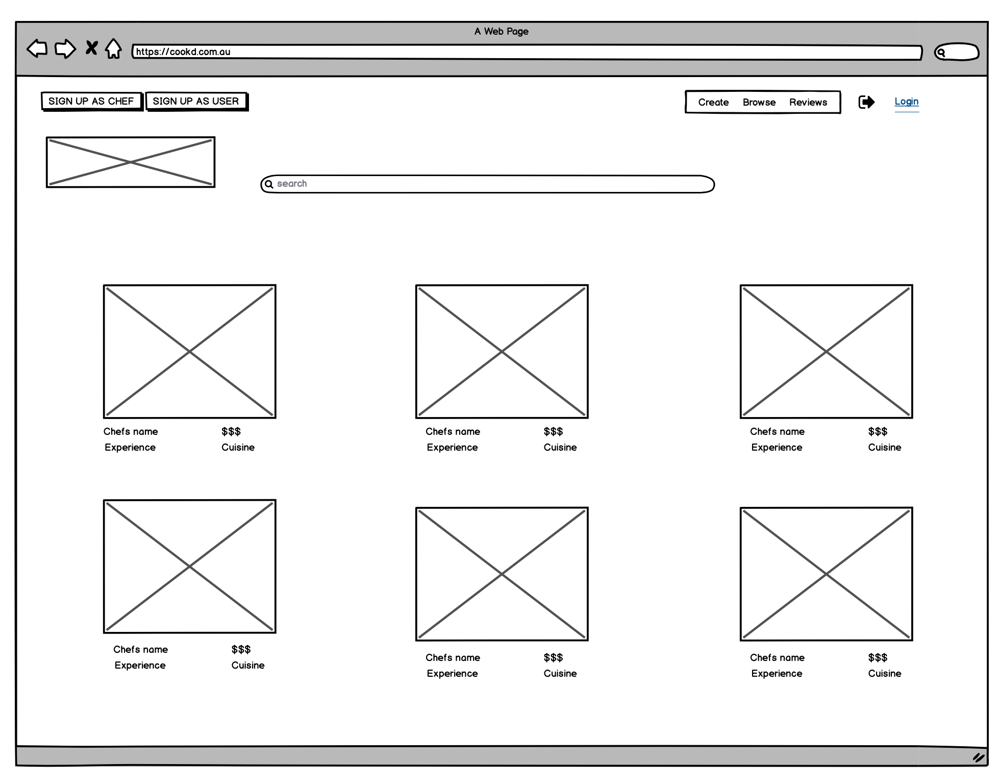

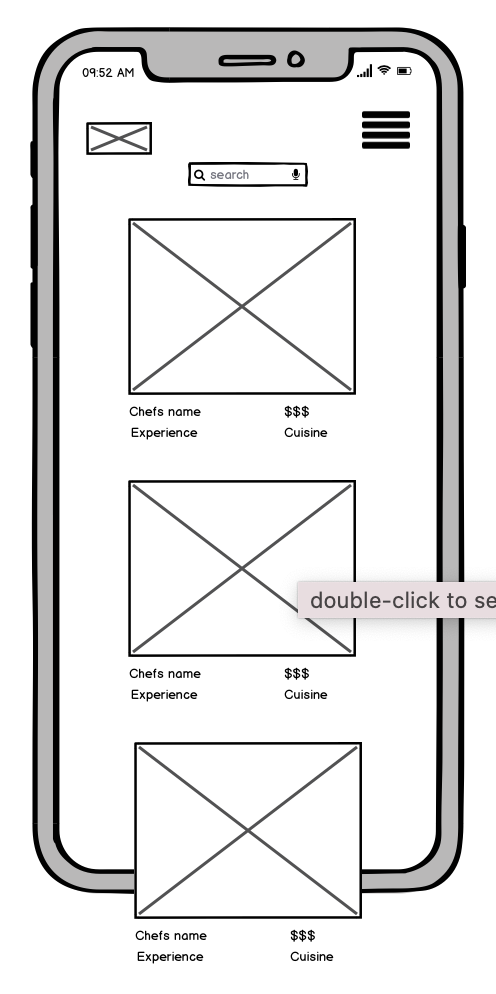

### Registration Page

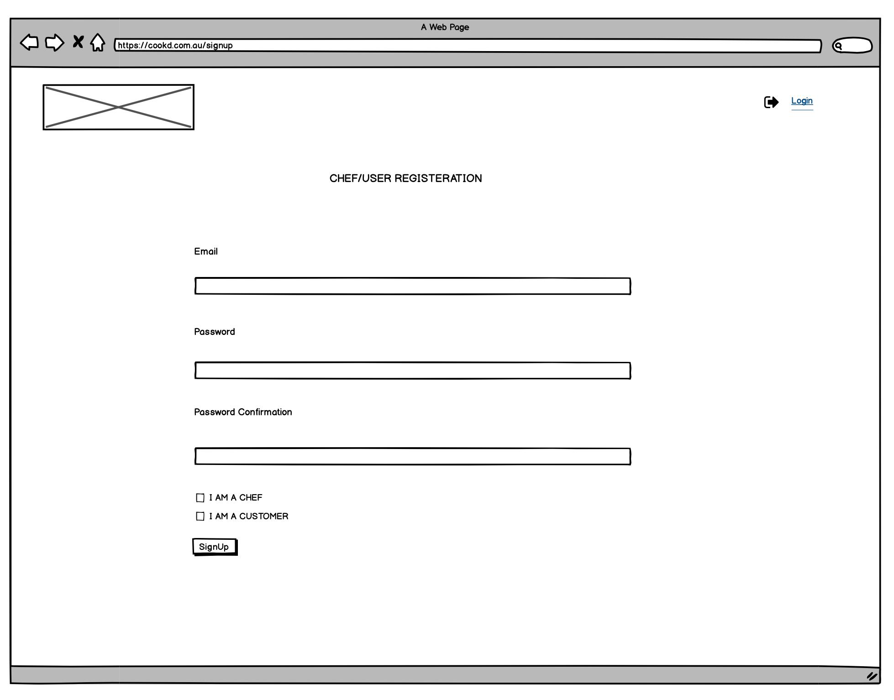

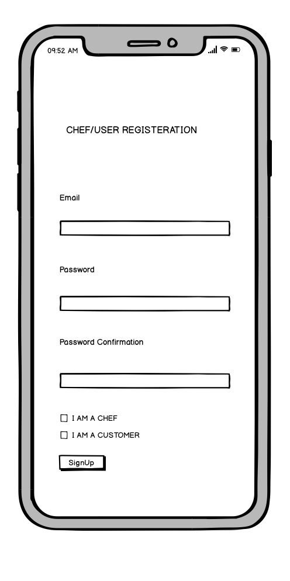

### Registration Page (customer profile)

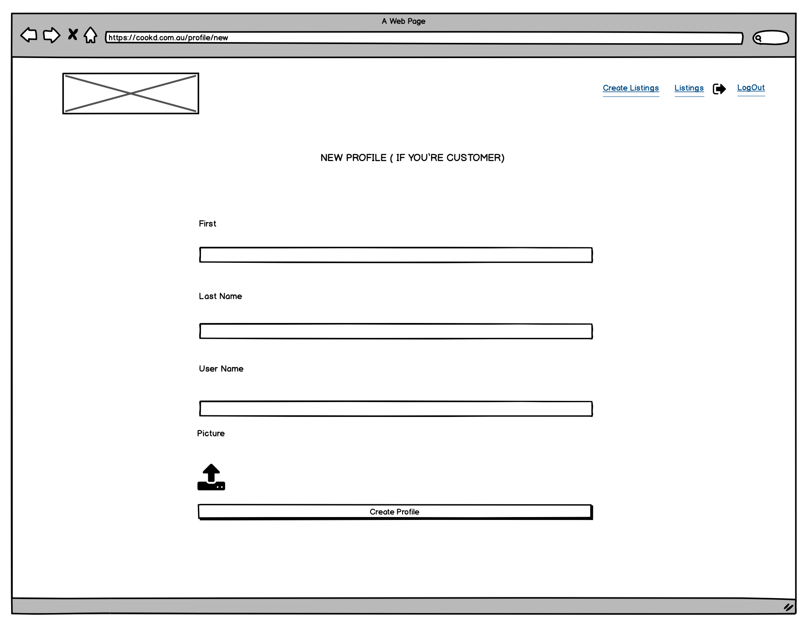

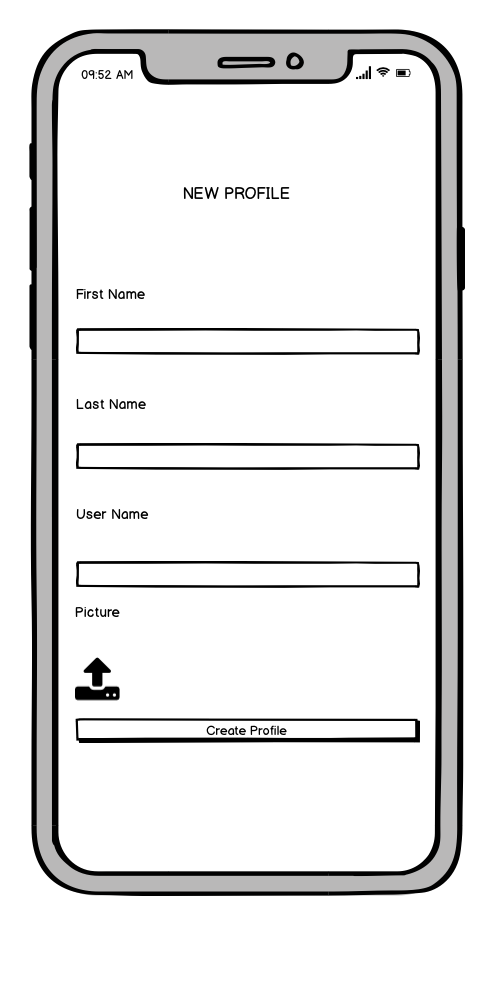

### Review Page


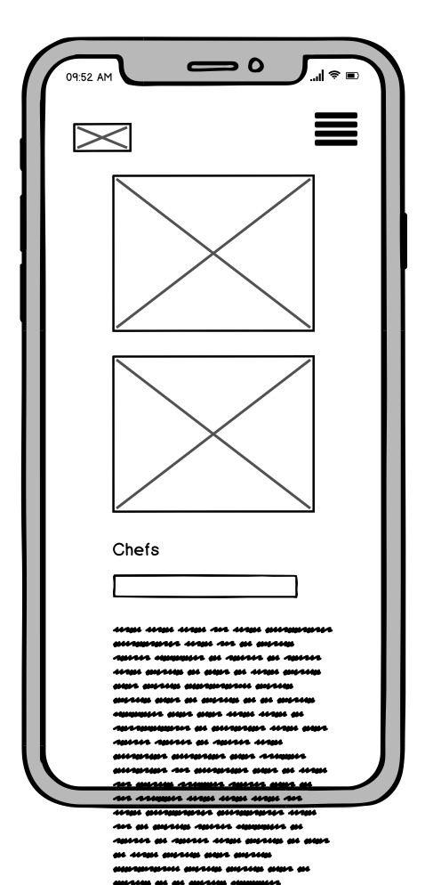

### Create Listing Page

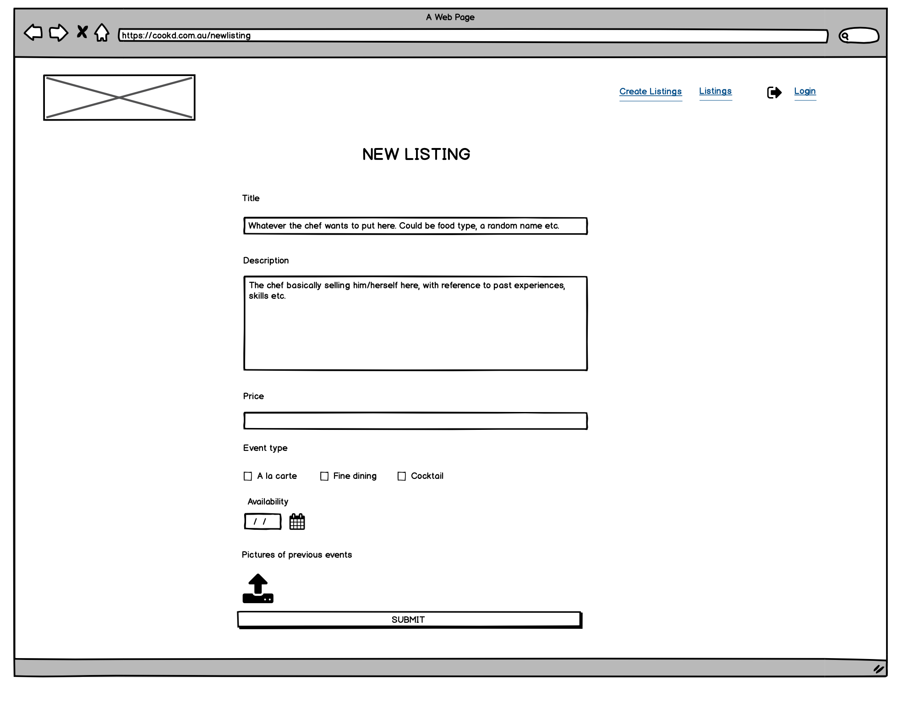

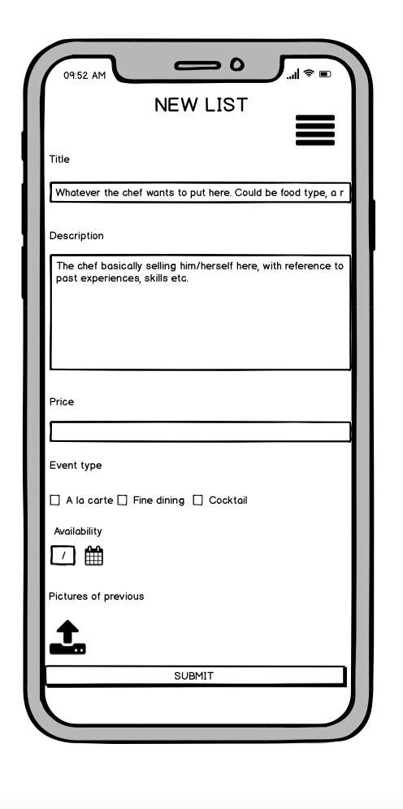

## R14 | ERD 

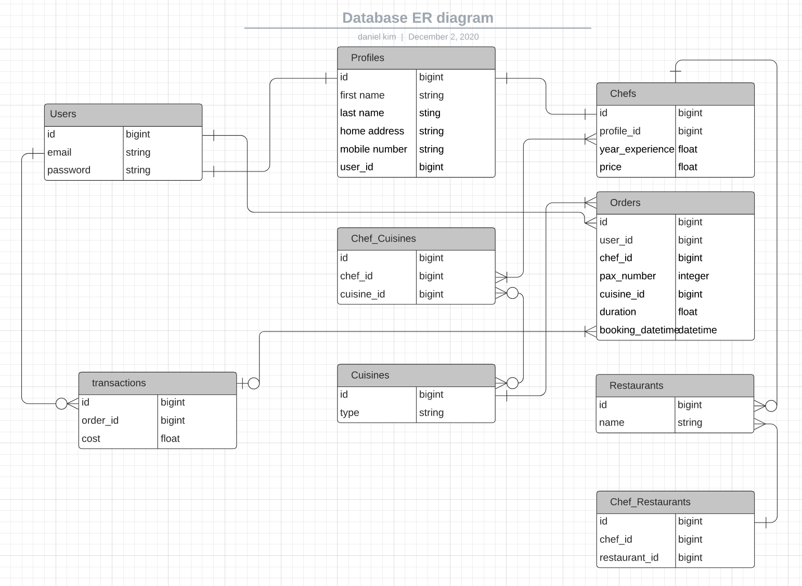


## R15 | High Level Components within Cookd

#### Chefs

When users navigate to this page, a tile list is diplayed of chefs with images of relevant stuff about the chefs. they can save and also write and give ratings for the chefs.

#### My accounts

users are prompted to select if theyre signing in as a chef or user accroding to what they signed up an account as. if they have no account they will have the option to signup.

Chefs can upload images, write about their ecepreince and skill set. chefs can update and or delte past posts images etc.

customers can also create a profile, and have the ability to rate chefs and also comment about their experiences publicly. customers can also delte posts theyve made previously.

#### Search/browse

users can use the search bar to navigate and browse for chefs and or cuisines theyre intereseted in. users can save facourites etc.

#### About


## R16 | 3rd Party service details used by CooKd

- Heroku:
  - A cloud platform or PaaS. Used by developers to quickly deploy web apps to market using a simple hassle-free platform .
- AWS:
  - A low cost infrastructure platform in the cloud and on-demand, that is Secure, Open & Flexible, and Agile.
    - S3 was used for storage when users upload their images. 
    - IAM is used by the Cookd app to help manage individual user access to the S3 storage. It allows programtic access to services by AWS.
- PostgreSQL:
  - The database management system, which is open source and free to use. It can also be known as just Postgres. It works as a relatioknal SQL databse. 
- Gems:
  - Devsie facilitates the password requirements and email verification proceses within the app. This Gem is responsible for authenicating and authorising users of the Cookd Web Application. 


## R17 | Describe your projects *models* in terms of the relationships (active record associations) they have with each other

Rails supports six types of associations:

- `belongs_to`
- `has_one`
- `has_many`
- `has_many :through`
- `has_one :through`
- `has_and_belongs_to_many


## R18 | Discuss the database relations to be implemented in your application

**Relations:**

- There are several types of relations used in cookd:
- **1 to 1:**
  - 1 to 1 (Optional): Users can optionally add a single address (coming in a future release) so a 1 to 1 relation was setup and set to optional
  - 1 to 1 (Mandatory): Each address must be tied to a single user, so a 1 to 1 relation was setup and was required

``` ruby rails

```


## R19 | Database Schema Design

```ruby
ActiveRecord::Schema.define(version: 2020_12_01_024338) do

  # These are extensions that must be enabled in order to support this database
  enable_extension "plpgsql"

  create_table "active_storage_attachments", force: :cascade do |t|
    t.string "name", null: false
    t.string "record_type", null: false
    t.bigint "record_id", null: false
    t.bigint "blob_id", null: false
    t.datetime "created_at", null: false
    t.index ["blob_id"], name: "index_active_storage_attachments_on_blob_id"
    t.index ["record_type", "record_id", "name", "blob_id"], name: "index_active_storage_attachments_uniqueness", unique: true
  end

  create_table "active_storage_blobs", force: :cascade do |t|
    t.string "key", null: false
    t.string "filename", null: false
    t.string "content_type"
    t.text "metadata"
    t.bigint "byte_size", null: false
    t.string "checksum", null: false
    t.datetime "created_at", null: false
    t.index ["key"], name: "index_active_storage_blobs_on_key", unique: true
  end

  create_table "chef_cuisines", force: :cascade do |t|
    t.bigint "chef_id", null: false
    t.bigint "cuisine_id", null: false
    t.datetime "created_at", precision: 6, null: false
    t.datetime "updated_at", precision: 6, null: false
    t.index ["chef_id"], name: "index_chef_cuisines_on_chef_id"
    t.index ["cuisine_id"], name: "index_chef_cuisines_on_cuisine_id"
  end

  create_table "chef_restaurants", force: :cascade do |t|
    t.bigint "chef_id", null: false
    t.bigint "restaurant_id", null: false
    t.datetime "created_at", precision: 6, null: false
    t.datetime "updated_at", precision: 6, null: false
    t.index ["chef_id"], name: "index_chef_restaurants_on_chef_id"
    t.index ["restaurant_id"], name: "index_chef_restaurants_on_restaurant_id"
  end

  create_table "chefs", force: :cascade do |t|
    t.bigint "profile_id", null: false
    t.float "year_experience"
    t.float "price"
    t.datetime "created_at", precision: 6, null: false
    t.datetime "updated_at", precision: 6, null: false
    t.index ["profile_id"], name: "index_chefs_on_profile_id"
  end

  create_table "cuisines", force: :cascade do |t|
    t.string "country"
    t.datetime "created_at", precision: 6, null: false
    t.datetime "updated_at", precision: 6, null: false
  end

  create_table "orders", force: :cascade do |t|
    t.bigint "user_id", null: false
    t.bigint "chef_id", null: false
    t.integer "pax_number"
    t.bigint "cuisine_id", null: false
    t.float "duration"
    t.string "booking_datetime"
    t.datetime "created_at", precision: 6, null: false
    t.datetime "updated_at", precision: 6, null: false
    t.index ["chef_id"], name: "index_orders_on_chef_id"
    t.index ["cuisine_id"], name: "index_orders_on_cuisine_id"
    t.index ["user_id"], name: "index_orders_on_user_id"
  end

  create_table "profiles", force: :cascade do |t|
    t.string "first_name"
    t.string "last_name"
    t.string "home_address"
    t.string "mobile_number"
    t.bigint "user_id", null: false
    t.datetime "created_at", precision: 6, null: false
    t.datetime "updated_at", precision: 6, null: false
    t.index ["user_id"], name: "index_profiles_on_user_id"
  end

  create_table "restaurants", force: :cascade do |t|
    t.string "name"
    t.datetime "created_at", precision: 6, null: false
    t.datetime "updated_at", precision: 6, null: false
  end

  create_table "transactions", force: :cascade do |t|
    t.bigint "order_id", null: false
    t.float "cost"
    t.datetime "created_at", precision: 6, null: false
    t.datetime "updated_at", precision: 6, null: false
    t.index ["order_id"], name: "index_transactions_on_order_id"
  end

  create_table "users", force: :cascade do |t|
    t.string "email", default: "", null: false
    t.string "encrypted_password", default: "", null: false
    t.string "reset_password_token"
    t.datetime "reset_password_sent_at"
    t.datetime "remember_created_at"
    t.datetime "created_at", precision: 6, null: false
    t.datetime "updated_at", precision: 6, null: false
    t.index ["email"], name: "index_users_on_email", unique: true
    t.index ["reset_password_token"], name: "index_users_on_reset_password_token", unique: true
  end

  add_foreign_key "active_storage_attachments", "active_storage_blobs", column: "blob_id"
  add_foreign_key "chef_cuisines", "chefs"
  add_foreign_key "chef_cuisines", "cuisines"
  add_foreign_key "chef_restaurants", "chefs"
  add_foreign_key "chef_restaurants", "restaurants"
  add_foreign_key "chefs", "profiles"
  add_foreign_key "orders", "chefs"
  add_foreign_key "orders", "cuisines"
  add_foreign_key "orders", "users"
  add_foreign_key "profiles", "users"
  add_foreign_key "transactions", "orders"
end

```


## R20 | Describe the way tasks are allocated and tracked in your project 

Please click this link to take you to live version https://trello.com/b/1N9pH8tV

This first screenshot was during the inital stages of the Cookd App Project. As you can see, the Backlog and Doing cards are quite full, as they would be.


In this second screenshot, the progession of Cookd is evident, by the lack of tasks left in critical cards such as Backlog and Doing, with the majority of the tasks have now made its way to the Done card!

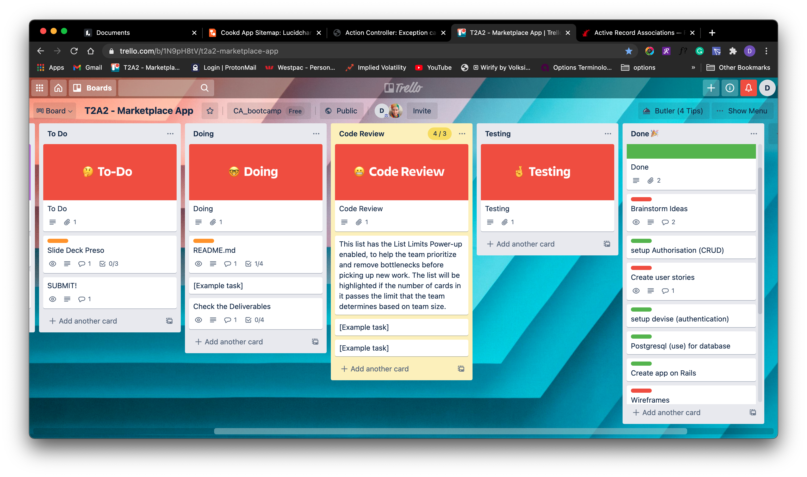


