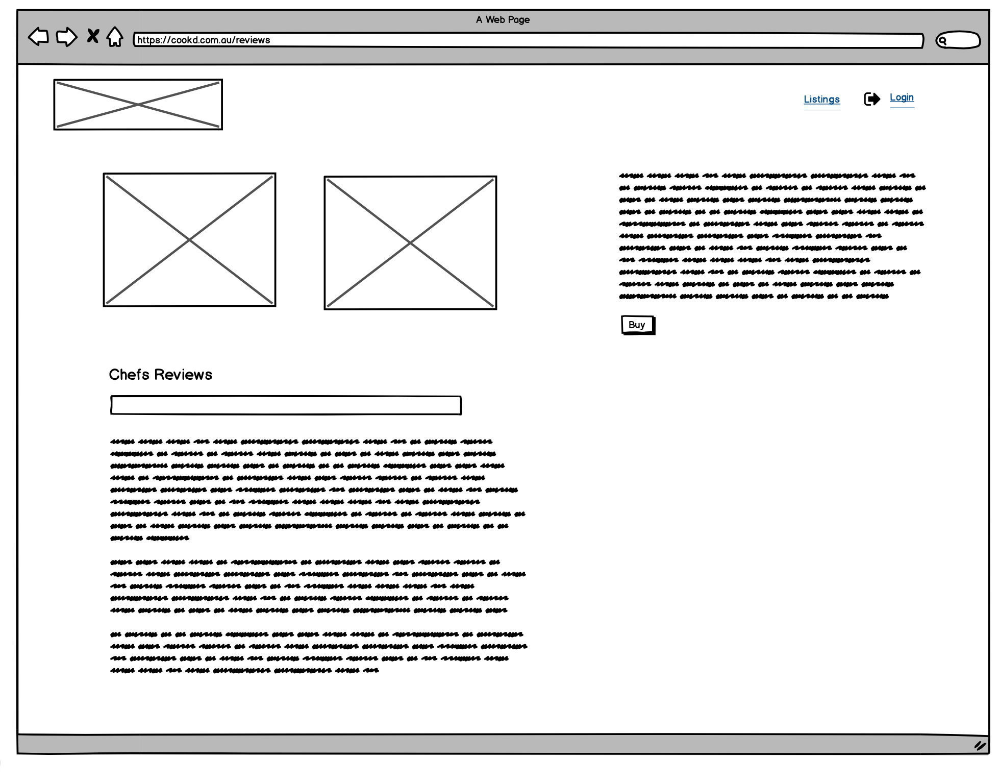
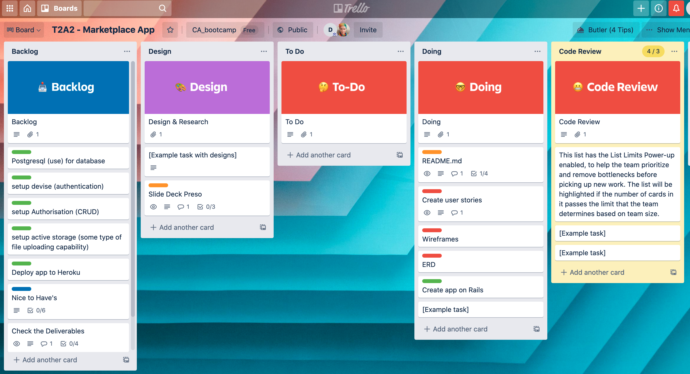

# - CooKd -

### T2A2 Marketplace Application - Daniel Kim

## R7 | Identify the Problem. 

Covid-19 has produced new and unique problems that have affected the global economy in an unprecedented scale. One in particular - out of the many indusrtires that've been affected, is the hospitalty industry. Resturants everywhere have closed or are restricted. What used to be a fun endeavour, has slowly lost its appeal. 

Not to mention, many hospitality jobs have gone. 

Consumers have also lost an importnant factor that plays in their work/life balance - entertainment by food. limited  choices have degraded consumer confidence as they now choose to just confide in thier own abode. 

## R8 | The Solution.

Cookd is a marketplace style web app that aims to bridge this forced gap in the market, by connecting proffesional and highly experienced chefs with your average consumer. 

Users looking to host a party, can order a professional chef to take care of the whole restaurant experience, but in the comfort of their own home.

The vision for this app was inspired by convenience. 

Chefs have jobs again - or moreso their own buisness (sidehusltle if you will?)

Eager consumers now have a means to satisfy their entertainment "itch".

## R9 | Heroku Deployment

https://cookd-app.herokuapp.com/

## R10 | GitHub

https://github.com/d1koder/cookd_app

## R11 | Overview - What is Cookd?

#### 		1 | Purpose

Cookd is a two sided market place for booking and creating lisitings for chefs and their services. The main focus will be for customers to browse various chefs online and to connect chefs with customers - and vice versa - so that chefs can have a platform to monetise their skills, and customers can conveniently book a chef for a party.

#### 		2 | Functionality/ Features

Cookd allows chefs to create profiles of themsleve, adding images and having it displayed on the home page in a blog style grid format. Each tile highlights their skills, cuisines on offer, pricing and availability. This in turn will allow the users - or customer - to browse through a list of chefs and/or cuisines according to the users desire. The users will be able to click on each tile to reveal more information such as, the chefs ratings and their availability. The user can in turn make a sound decision to book their desired chef for a specific date/time. Chefs and users will have the ability to "CRUD" their profiles if they wish.

#### 2.1 User accounts

Ability for Chefs and/or Users to create for themselves a new profile if they haven't signed up already. Also where Users and Chefs can sign in to existing accounts. 

#### 2.2 Browse

A list of available Chefs laid out in a blog style format, complete with profile pictures and details of their skills and avilability. Users should be able to click on the tiles to expand.

#### 2.3 Chefs

Chefs can create profiles, add, edit and delete parts of their profile.

#### 2.4 My account

This is were users can login with their credentials, as either a Chef or User. They can also have the option at the bottom to delete their account.

#### 2.5 About

This is where information about how to use the app and its purpose, will be detailed.

#### 2.6 FAQ (In future app update)

This is where users can view all relevant policies. As well as common questions. 

#### 		3 | Sitemap


#### 		4 | Screenshots

* The Home Page - Cookd App.


* Create a New Chef Profile page - New Profile.


* A complete, Chefs Profile - My Profile.


#### 		5 | Target Audience

Chefs looking to monetise their experience through a digital platform, and create for themselves a reputation in a new market. 

Users looking for connivence when it comes to organising and hosting a party or event at their place of residence, without compromising on the quaility.

#### 		6 | Tech Stack

| Technologies        |                 |
| ------------------- | --------------- |
| **Front-end**:      | HTML, CSS, Sass |
| **Back-end**:       | Ruby on Rails   |
| **Deployment**:     | Heroku          |
| **Active Storage**: | AWS, S3, IAM    |

## R12 | User Story 

As a cusotmer, I want to have an account, so that chefs that I book can be confirmed by me when they show up to my venue.

As a chef, I want an account, so that I may be able to monetise my services. 

As a chef, I want to be able to display my qualities such as experience and qualifications, so that customers have confidence in my abilities. 

As a chef I want a way to display my price and cuisines, so that customers can get an idea of prices.

As a chef I want a way to display my avialability, so that customers can plan to book in advanced. 

As a customer I want a way to display my address, so that the chef knows how far they have to travel to me/venue.

As a customer, I want to see what other customer reviews have been left, so that I can feel safe and be able to trust in the chefs abilities for my specific needs. 

As a chef, I want to be able to edit or delete listings, as I progress professionally.

As a customer, I want to be able to pay with a credit card, so that I can confirm my booking with a particular chef.

## R13 | Wireframes 

### Home Page


### Registration Page


### Registration Page (customer profile)


### Review Page




### Create Listing Page


## R14 | ERD 


## R15 | High Level Components within Cookd

#### Chefs Page New

When users navigate to this page, a tile list is diplayed of all the chefs along with profile pictures and details of the chef.  Chefs can add their details and edit theri profile if they wish here too.

#### Sign In/Up

Users are prompted to sign in and/or sign up. They have the option to sign in or create a new profile by first signing up.

Chefs can upload images, write about their experience and skill set, while also adding in their hourly price. Chefs can update and or delete past posts images etc.

Customers can also create a profile, and have the ability to rate chefs and also comment about their experiences publicly *(In future updates to app)*. Customers can also delete posts they've made previously.

#### Search/Browse

*(In future app update)* 

Users can use the search bar to navigate and browse for chefs and or cuisines theyre intereseted in. users can save facourites etc.

#### Transactions 

Users can automatically see the total cost displayed in front of them, after they've selected a paticular chef with specific dates/times. This is calculated within the Model using ruby methods, linked by the Orders and Chefs table.

## R16 | 3rd Party service details used by CooKd

#### Heroku:

- A cloud platform or PaaS. Used by developers to quickly deploy web apps to market using a simple hassle-free platform .

#### AWS:

- A low cost infrastructure platform in the cloud and on-demand, that is Secure, Open & Flexible, and Agile.
  - S3 was used for storage when users upload their images. 
  - IAM is used by the Cookd app to help manage individual user access to the S3 storage. It allows programtic access to services by AWS.

#### PostgreSQL:

- The database management system, which is open source and free to use. It can also be known as just Postgres. It works as a relatioknal SQL databse. 

#### Gems:

- Devsie facilitates the password requirements and email verification proceses within the app. This Gem is responsible for authenicating and authorising users of the Cookd Web Application. 

## R17 | Describe your projects *models* in terms of the relationships (active record associations) they have with each other

Rails supports six types of associations. Cookd App employs several of the below associations :

- `belongs_to`
- `has_one`
- `has_many`
- `has_many :through`
- `has_one :through`
- `has_and_belongs_to_many

| Models               | Description                                         |
| -------------------- | --------------------------------------------------- |
| **Users**            | The customers looking to hire Chefs.                |
| **Profile**          | Details of Chef. Name, origin etc.                  |
| **Chef**             | Form to enter years of experience and price.        |
| **Cuisine**          | The type of Cuisines available.                     |
| **Chef_Cuisines**    | List of all the Cuisines a Chef can cook.           |
| **Restaurant **      | A list of all the Restaurants.                      |
| **Chef_Restaurant ** | A list of all the Restaurants a chef has worked at. |
| **Order**            | A breakdown of the order by the User                |
| **Transaction**      | Shows cost breakdown.                               |

### Associations:

**Users**

```ruby
class User < ApplicationRecord
  # Include default devise modules. Others available are:
  # :confirmable, :lockable, :timeoutable, :trackable and :omniauthable
  devise :database_authenticatable, :registerable,
         :recoverable, :rememberable, :validatable
  has_one :profile, class_name: "Profile"
end
```

**Profile**

```ruby
class Profile < ApplicationRecord
  belongs_to :user
  has_one_attached :picture
  has_one :chef, dependent: :destroy
  validates :first_name, presence: true
  validates :last_name, presence: true
  validates :home_address, presence: true
  validates :mobile_number, presence: true
  validates :user_id, presence: true
end
```

**Chef**   

``` ruby
class Chef < ApplicationRecord
  belongs_to :profile
  has_many :chef_cuisines
  has_many :cuisines, through: :chef_cuisines
  has_many :chef_restaurants
  has_many :restaurants, through: :chef_restaurants
  validates :profile_id, presence: true
  validates :year_experience, presence: true
  validates :price, presence: true
end
```

**Cuisine** 

```ruby
class Cuisine < ApplicationRecord
    has_many :chef_cuisines
    has_many :chefs, through: :chef_cuisines
    validates :type, presence: true
end
```

**Chef_Cuisine**

```ruby
class ChefCuisine < ApplicationRecord
  belongs_to :chef
  belongs_to :cuisine
  validates :chef_id, presence: true
  validates :cuisine_id, presence: true
end
```

**Restaurant **  

```ruby
class Restaurant < ApplicationRecord
    has_many :chef_restaurants
    has_many :chefs, through: :chef_restaurants
    validates :name, presence: true
end
```

**Chef_Restaurant **  

```ruby
class ChefRestaurant < ApplicationRecord
  belongs_to :chef
  belongs_to :restaurant
  validates :chef_id, presence: true
  validates :restaurant_id, presence: true
end
```

 **Order**   

```ruby
class Order < ApplicationRecord
  belongs_to :user
  belongs_to :chef
  belongs_to :cuisine
  validates :user_id, presence: true
  validates :chef_id, presence: true
  validates :pax_number, presence: true
  validates :cuisine_id, presence: true
  validates :duration, presence: true
  validates :booking_datetime, presence: true
end
```

**Transaction**

```ruby
class Transaction < ApplicationRecord
  belongs_to :order
  before_save :save_cost
  validates :order_id, presence: true
  validates :cost, presence: true

  def save_cost
    self.cost = self.order.duration * self.order.chef.price
  end

end
```

## R18 | Discuss the database relations to be implemented in your application

There are several types of relations used in cookd, a few of them will be briefly mentioned here. Please check ERD for further clarity:

**1 to 1:**

- 1 to 1: Users can only have one Profile. And one Profile can only belong to one User. 
- The same also goes for Chefs and Profiles. Only one Chef can belong to one Profile, and one Profile can only belong to one Chef.

**1 to Many:**

- Users can have many Orders, but only an Order can only have one and only one User.
- Same can be said about Transactions. Users can have many Transactions.
- Chefs can belong to many Restaurants.
- And an Order can have many Cuisines.

**Many to Many:**

- Chefs can know many Chef_Cuisines, and Chef_Cuisines can belong to many different Chefs.
- Cuisines can belong to a whole host of different Chef_cuisines, and there can be many Chef_cuisines as there are Cuisines.

## R19 | Database Schema Design

```ruby
ActiveRecord::Schema.define(version: 2020_12_01_024338) do

  # These are extensions that must be enabled in order to support this database
  enable_extension "plpgsql"

  create_table "active_storage_attachments", force: :cascade do |t|
    t.string "name", null: false
    t.string "record_type", null: false
    t.bigint "record_id", null: false
    t.bigint "blob_id", null: false
    t.datetime "created_at", null: false
    t.index ["blob_id"], name: "index_active_storage_attachments_on_blob_id"
    t.index ["record_type", "record_id", "name", "blob_id"], name: "index_active_storage_attachments_uniqueness", unique: true
  end

  create_table "active_storage_blobs", force: :cascade do |t|
    t.string "key", null: false
    t.string "filename", null: false
    t.string "content_type"
    t.text "metadata"
    t.bigint "byte_size", null: false
    t.string "checksum", null: false
    t.datetime "created_at", null: false
    t.index ["key"], name: "index_active_storage_blobs_on_key", unique: true
  end

  create_table "chef_cuisines", force: :cascade do |t|
    t.bigint "chef_id", null: false
    t.bigint "cuisine_id", null: false
    t.datetime "created_at", precision: 6, null: false
    t.datetime "updated_at", precision: 6, null: false
    t.index ["chef_id"], name: "index_chef_cuisines_on_chef_id"
    t.index ["cuisine_id"], name: "index_chef_cuisines_on_cuisine_id"
  end

  create_table "chef_restaurants", force: :cascade do |t|
    t.bigint "chef_id", null: false
    t.bigint "restaurant_id", null: false
    t.datetime "created_at", precision: 6, null: false
    t.datetime "updated_at", precision: 6, null: false
    t.index ["chef_id"], name: "index_chef_restaurants_on_chef_id"
    t.index ["restaurant_id"], name: "index_chef_restaurants_on_restaurant_id"
  end

  create_table "chefs", force: :cascade do |t|
    t.bigint "profile_id", null: false
    t.float "year_experience"
    t.float "price"
    t.datetime "created_at", precision: 6, null: false
    t.datetime "updated_at", precision: 6, null: false
    t.index ["profile_id"], name: "index_chefs_on_profile_id"
  end

  create_table "cuisines", force: :cascade do |t|
    t.string "country"
    t.datetime "created_at", precision: 6, null: false
    t.datetime "updated_at", precision: 6, null: false
  end

  create_table "orders", force: :cascade do |t|
    t.bigint "user_id", null: false
    t.bigint "chef_id", null: false
    t.integer "pax_number"
    t.bigint "cuisine_id", null: false
    t.float "duration"
    t.string "booking_datetime"
    t.datetime "created_at", precision: 6, null: false
    t.datetime "updated_at", precision: 6, null: false
    t.index ["chef_id"], name: "index_orders_on_chef_id"
    t.index ["cuisine_id"], name: "index_orders_on_cuisine_id"
    t.index ["user_id"], name: "index_orders_on_user_id"
  end

  create_table "profiles", force: :cascade do |t|
    t.string "first_name"
    t.string "last_name"
    t.string "home_address"
    t.string "mobile_number"
    t.bigint "user_id", null: false
    t.datetime "created_at", precision: 6, null: false
    t.datetime "updated_at", precision: 6, null: false
    t.index ["user_id"], name: "index_profiles_on_user_id"
  end

  create_table "restaurants", force: :cascade do |t|
    t.string "name"
    t.datetime "created_at", precision: 6, null: false
    t.datetime "updated_at", precision: 6, null: false
  end

  create_table "transactions", force: :cascade do |t|
    t.bigint "order_id", null: false
    t.float "cost"
    t.datetime "created_at", precision: 6, null: false
    t.datetime "updated_at", precision: 6, null: false
    t.index ["order_id"], name: "index_transactions_on_order_id"
  end

  create_table "users", force: :cascade do |t|
    t.string "email", default: "", null: false
    t.string "encrypted_password", default: "", null: false
    t.string "reset_password_token"
    t.datetime "reset_password_sent_at"
    t.datetime "remember_created_at"
    t.datetime "created_at", precision: 6, null: false
    t.datetime "updated_at", precision: 6, null: false
    t.index ["email"], name: "index_users_on_email", unique: true
    t.index ["reset_password_token"], name: "index_users_on_reset_password_token", unique: true
  end

  add_foreign_key "active_storage_attachments", "active_storage_blobs", column: "blob_id"
  add_foreign_key "chef_cuisines", "chefs"
  add_foreign_key "chef_cuisines", "cuisines"
  add_foreign_key "chef_restaurants", "chefs"
  add_foreign_key "chef_restaurants", "restaurants"
  add_foreign_key "chefs", "profiles"
  add_foreign_key "orders", "chefs"
  add_foreign_key "orders", "cuisines"
  add_foreign_key "orders", "users"
  add_foreign_key "profiles", "users"
  add_foreign_key "transactions", "orders"
end

```

## R20 | Describe the way tasks are allocated and tracked in your project 

Please click this link to take you to live version https://trello.com/b/1N9pH8tV

This first screenshot was during the inital stages of the Cookd App Project. As you can see, the Backlog and Doing cards are quite full, as they would be.



In this second screenshot, the progession of Cookd is evident, by the lack of tasks left in critical cards such as Backlog and Doing, with the majority of the tasks have now made its way to the Done card!


